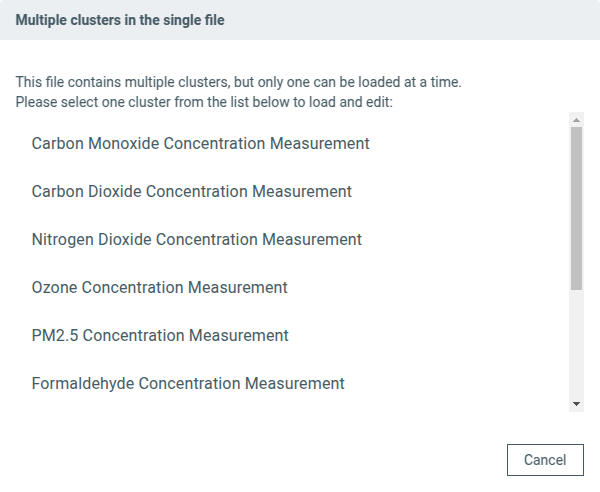

# Creating a cluster extension

This guide describes how to create a cluster extension and save it as an XML file using the {{app_name}}.

A cluster extension allows you to add new attributes, commands, events, enumerations, or structures to an existing Matter cluster without modifying the original cluster definition. This is useful when you need to extend standard Matter clusters with manufacturer-specific functionality.

{{matter_requirements}}
Make also sure that you have an existing cluster XML file that you want to extend, a clear understanding of what additional elements need to be added, and familiarity with the original cluster's structure and functionality.

!!! note "Note"
    When adding new elements, make sure that the codes you assign do not conflict with existing elements in the original cluster. The {{app_name}} will help you identify conflicts when saving.

To create a cluster extension, complete the following steps:

1. Click the **Load from file** button to load an existing cluster definition. 
   Use the system file dialog to select the XML cluster file.
   If the file contains more than one cluster, the tool shows the list of available clusters in the context menu.

   

   After loading, all tabs will be populated with the data from the loaded cluster.

2. Open one by one the Commands, Attributes, and Events tabs and add the required elements to the cluster. 
   Click the **Add** button on the top of each element tab to add a new element to the cluster.
   See [Overview](overview.md#commands-tab) for more information about the fields.

3. Open one by one the Enums and Structures tabs and add the required elements. 
   The enums and structs do not belong to the cluster, but you can assign them to one or more clusters.
   See [Overview](overview.md#enums-tab) for more information about the fields.

4. Click the **Save extension to file** button to save the cluster extension to a file.

The {{app_name}} validates that all required fields are filled before saving. If required fields are not filled or if there are no differences between the current cluster and the loaded cluster, you will see a [notification](overview.md#notifications).
