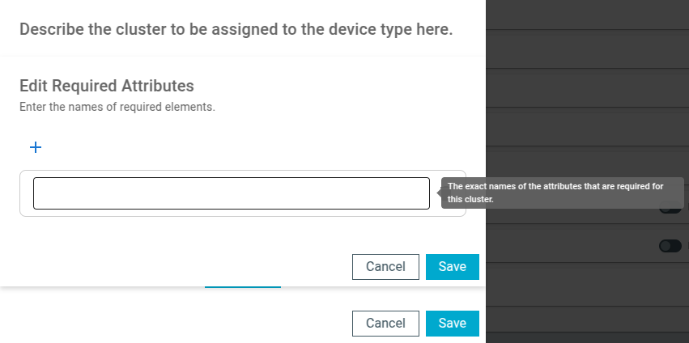

# Creating a new device type

This guide describes how to create a new device type and save it as an XML file using the {{app_name}}.

A device type defines the clusters, attributes, commands, and events that a specific type of Matter device supports. Creating a new device type allows you to define custom device functionality that isn't covered by the standard Matter Device Type Library specification.

!!! note "Note"
    {{matter_requirements}}

Before creating a new device type, ensure you have a clear understanding of the device's intended functionality, knowledge of which clusters, attributes, commands, and events the device needs, and familiarity with Matter device type concepts and requirements.

!!! info "Tip"
    - When adding required attributes, commands, or events, ensure that the names you enter exactly match the names defined in the corresponding cluster. The tool will validate these references during the save process.
    - Use the details view to verify that your cluster assignments are correctly configured:

        

To create a new device type, complete the following steps:

1. Open the Device Type tab and fill in the required fields marked with the asterisk. 
   See [Overview](overview.md#device-type-tab) for more information about the fields.

2. Click the **Add Cluster assignment to device type** button to add the required clusters to the device type. 
   See [Overview](overview.md#add-cluster-assignment-to-device-type) for more information about the fields.

3. Click one of the **Required** buttons.
 in the new dialog window, add a new assignment by clicking the plus icon and filling in the exact name of the attribute, command, or event.

   For example, the following figure shows the dialog window to assign required attribute to the cluster:

   

4. Optionally, specify the features of the device type by clicking the **Features** button. 
5. In the new dialog window, click the plus icon to add a new feature, and fill in the code and name of the feature.
6. Click the **Save extension to file** or **Save cluster type to file** button depending on the purpose of the file. 
   See [Overview](overview.md#side-panel-sections) for more information about these buttons.

The {{app_name}} validates that all required fields are filled before saving. If required fields are not filled, you will see an [error message](overview.md#notifications).
